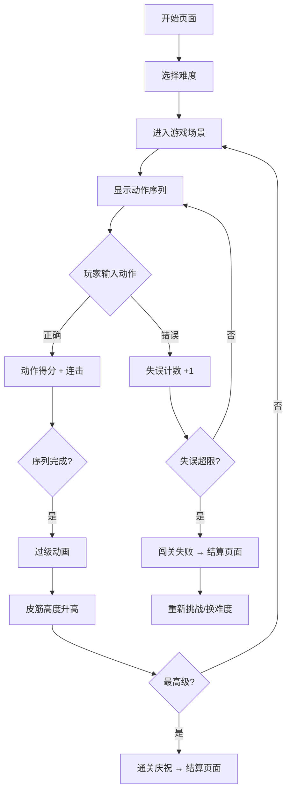

## 1. 产品概述

跳皮筋游戏是一款基于 Web 的经典童年跳皮筋互动游戏，通过 Canvas 渲染还原真实跳皮筋场景，玩家操控角色在皮筋之间完成踩、勾、挑、绕等脚步动作，逐级挑战升高的皮筋高度，体验完整的花样过级玩法。
- 面向怀旧玩家与休闲游戏用户，重现校园课间的跳皮筋乐趣
- 通过渐进式关卡设计与丰富脚步花样，提供有深度的操作体验与成就感

## 2. 核心功能

### 2.1 用户角色
| 角色 | 说明 |
|------|------|
| 玩家 | 操控主角完成脚步动作，逐级闯关 |
| 助手（左/右） | 自动撑皮筋的角色，随关卡提升调整皮筋高度 |

### 2.2 功能模块
1. **开始页面**: 游戏标题、开始按钮、难度选择、操作说明
2. **游戏页面**: 皮筋场地、助手角色、玩家角色、动作提示、计分板、关卡信息
3. **结算页面**: 过级结果、分数统计、脚步完成度、重新挑战/下一关

### 2.3 页面详情
| 页面名称 | 模块名称 | 功能描述 |
|----------|----------|----------|
| 开始页面 | 游戏标题区 | 展示游戏名称与怀旧风格动画 |
| 开始页面 | 操作说明 | 图文展示踩、勾、挑、绕四个动作的按键映射 |
| 开始页面 | 难度选择 | 简单/普通/困难三档，影响动作容错与时间限制 |
| 游戏页面 | 皮筋场地 | Canvas 渲染皮筋、地面、背景场景 |
| 游戏页面 | 助手角色 | 左右两名撑皮筋人物，带呼吸动画与高度调节 |
| 游戏页面 | 玩家角色 | 可操控的跳跃角色，带动作状态机动画 |
| 游戏页面 | 动作提示栏 | 屏幕下方显示当前需要完成的动作序列 |
| 游戏页面 | 计分与关卡 | 顶部 HUD 显示当前关卡、分数、生命值 |
| 游戏页面 | 皮筋高度指示 | 右侧标尺显示当前皮筋高度与目标高度 |
| 结算页面 | 过级结果 | 展示是否成功过级及总评 |
| 结算页面 | 分数统计 | 各动作完成度、连击数、完美次数 |
| 结算页面 | 操作按钮 | 重新挑战当前关卡 / 进入下一关 |

## 3. 核心流程

玩家进入游戏后选择难度，进入游戏场景。每关由一组脚步动作序列组成，玩家需按提示依次完成踩、勾、挑、绕等动作。完成整套动作即为过级，皮筋高度随之升高，动作序列也愈发复杂。若失误次数超过容错上限则闯关失败。

## 4. 用户界面设计

### 4.1 设计风格
- 主色调：暖橙色（#FF6B35）+ 草绿色（#4CAF50），唤起童年操场记忆
- 辅助色：天蓝色（#87CEEB）作为背景天空色，米白色（#FFF8E7）作为地面色
- 按钮风格：圆角 3D 立体按钮，带按压动画效果
- 字体：标题使用手写风格字体，正文使用清晰的无衬线字体
- 布局：居中 Canvas 游戏区域，顶部 HUD 信息栏，底部动作提示区
- 图标/表情风格：卡通像素风，配合怀旧主题

### 4.2 页面设计概述
| 页面名称 | 模块名称 | UI 元素 |
|----------|----------|---------|
| 开始页面 | 游戏标题区 | 大号手写体标题，皮筋弹跳动画背景，橙色渐变 |
| 开始页面 | 操作说明 | 四个动作卡片（踩/勾/挑/绕），对应按键高亮显示 |
| 开始页面 | 难度选择 | 三个圆角按钮，选中态带缩放与光晕效果 |
| 游戏页面 | Canvas 场景 | 蓝天白云背景、绿色地面、两名助手、皮筋弹性动画 |
| 游戏页面 | HUD 信息栏 | 左侧关卡数，中间分数，右侧生命心形图标 |
| 游戏页面 | 动作提示栏 | 半透明底栏，动作图标序列从右向左滚动 |
| 结算页面 | 结果展示 | 大号过级/失败文字，带粒子特效 |
| 结算页面 | 分数统计 | 圆环进度图展示各动作完成率 |

### 4.3 响应式设计
- 桌面端优先（主要游戏平台），Canvas 保持 16:9 比例居中
- 移动端适配：Canvas 缩放，底部增加虚拟方向键和动作按钮
- 触控优化：动作按钮足够大，支持滑动组合动作

### 4.4 动作系统设计
| 动作 | 按键（键盘） | 按键（触控） | 描述 |
|------|-------------|-------------|------|
| 踩 | ↓ | 踩按钮 | 脚踩住皮筋 |
| 勾 | ↑ | 勾按钮 | 脚尖勾住皮筋上拉 |
| 挑 | → | 挑按钮 | 脚背挑起皮筋 |
| 绕 | ←→ | 绕按钮 | 脚绕皮筋一圈 |
| 跳 | Space | 跳按钮 | 跳跃越过皮筋 |

### 4.5 关卡设计
| 关卡 | 皮筋高度 | 动作序列 | 难度特征 |
|------|----------|----------|----------|
| 1 | 脚踝 | 踩→跳→踩→跳 | 入门，仅踩和跳 |
| 2 | 小腿 | 踩→勾→跳→踩→勾→跳 | 引入勾动作 |
| 3 | 膝盖 | 踩→勾→挑→跳→踩→勾→挑→跳 | 引入挑动作 |
| 4 | 大腿 | 踩→勾→挑→绕→跳（重复2次） | 引入绕动作 |
| 5 | 腰部 | 混合4种动作，8步序列 | 全动作混合 |
| 6 | 胸部 | 混合动作，10步序列，节奏加快 | 高度+复杂度 |
| 7 | 肩部 | 混合动作，12步序列，快速节奏 | 极限挑战 |
| 8 | 颈部 | 混合动作，14步序列 | 终极关卡 |
