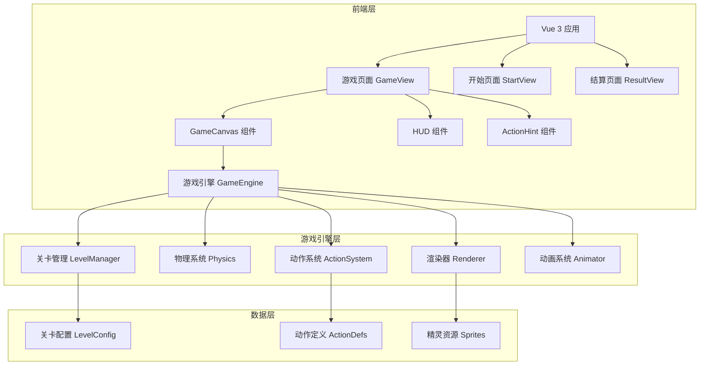

## 1. 架构设计



## 2. 技术说明

- 前端框架：Vue 3 + TypeScript + Vite
- 样式方案：Tailwind CSS 3
- 游戏渲染：HTML5 Canvas 2D
- 状态管理：Vue 3 组合式 API (composables)
- 路由：Vue Router 4
- 初始化工具：vite-init (vue-ts 模板)
- 后端：无（纯前端游戏）
- 数据存储：localStorage（存档与最高分）

## 3. 路由定义

| 路由 | 用途 |
|------|------|
| / | 开始页面，游戏标题、难度选择、操作说明 |
| /game | 游戏主页面，Canvas 场景与 HUD |
| /result | 结算页面，分数统计与操作按钮 |

## 4. 核心模块设计

### 4.1 游戏引擎 (GameEngine)

```typescript
interface GameEngine {
  canvas: HTMLCanvasElement
  ctx: CanvasRenderingContext2D
  gameState: GameState
  start(): void
  pause(): void
  resume(): void
  reset(): void
  gameLoop(timestamp: number): void
}

interface GameState {
  currentLevel: number
  score: number
  lives: number
  combo: number
  actionIndex: number
  phase: 'ready' | 'playing' | 'paused' | 'levelComplete' | 'gameOver'
  rubberBandHeight: number
}
```

### 4.2 动作系统 (ActionSystem)

```typescript
type ActionType = 'step' | 'hook' | 'flick' | 'wrap' | 'jump'

interface ActionDef {
  type: ActionType
  name: string
  key: string
  icon: string
  animFrames: string[]
  duration: number
}

interface ActionSequence {
  actions: ActionType[]
  bpm: number
}
```

### 4.3 关卡管理 (LevelManager)

```typescript
interface LevelConfig {
  level: number
  heightLabel: string
  rubberBandY: number
  actions: ActionType[]
  bpm: number
  maxMistakes: number
}

interface LevelResult {
  level: number
  perfectCount: number
  goodCount: number
  missCount: number
  maxCombo: number
  score: number
  passed: boolean
}
```

### 4.4 物理系统 (Physics)

```typescript
interface PhysicsBody {
  x: number
  y: number
  vx: number
  vy: number
  width: number
  height: number
  gravity: number
  isGrounded: boolean
}

interface RubberBand {
  leftX: number
  rightX: number
  y: number
  targetY: number
  elasticity: number
  amplitude: number
  phase: number
}
```

### 4.5 角色系统

```typescript
interface Character {
  x: number
  y: number
  width: number
  height: number
  state: 'idle' | 'jumping' | 'stepping' | 'hooking' | 'flicking' | 'wrapping'
  facingRight: boolean
  animFrame: number
  animTimer: number
}

interface Assistant extends Character {
  side: 'left' | 'right'
  armUpAngle: number
  targetArmUpAngle: number
}
```

## 5. 项目文件结构

```
src/
├── components/
│   ├── GameCanvas.vue        # Canvas 游戏渲染组件
│   ├── HUD.vue               # 顶部信息栏
│   ├── ActionHint.vue         # 底部动作提示
│   ├── StartScreen.vue        # 开始界面
│   ├── ResultPanel.vue        # 结算面板
│   └── VirtualControls.vue    # 移动端虚拟按键
├── composables/
│   ├── useGameEngine.ts       # 游戏引擎核心逻辑
│   ├── useInput.ts            # 输入处理
│   ├── useAudio.ts            # 音效管理
│   └── useStorage.ts          # 本地存储
├── game/
│   ├── engine.ts              # 游戏主循环
│   ├── renderer.ts            # Canvas 渲染器
│   ├── physics.ts             # 物理系统
│   ├── actions.ts             # 动作定义与判定
│   ├── levels.ts              # 关卡配置
│   ├── characters.ts          # 角色定义
│   └── sprites.ts             # 精灵绘制函数
├── pages/
│   ├── StartView.vue          # 开始页面
│   ├── GameView.vue           # 游戏页面
│   └── ResultView.vue         # 结算页面
├── types/
│   └── game.ts                # 游戏类型定义
├── App.vue
├── main.ts
└── style.css
```

## 6. 性能优化策略

- Canvas 渲染使用 requestAnimationFrame，保持 60fps
- 精灵图使用代码绘制（纯 Canvas 2D 绘图），无需加载外部图片资源
- 皮筋弹性动画使用正弦波模拟，避免复杂物理计算
- 离屏 Canvas 缓存静态背景元素
- 使用 Object Pool 复用粒子对象，避免 GC 压力
